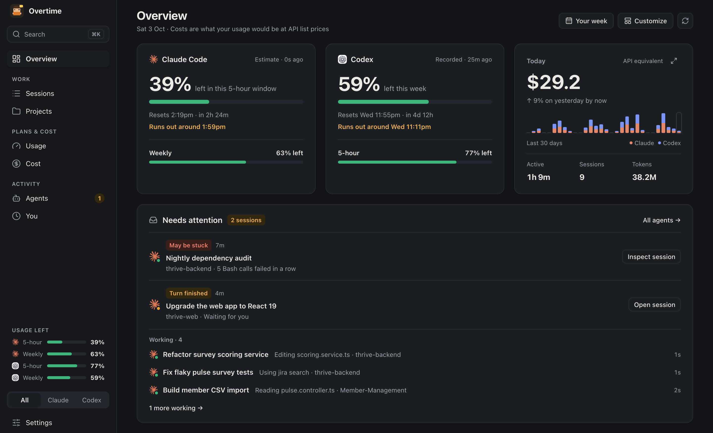

# Overtime

A dashboard for your Claude Code, Codex and Pi agents: how much of your plan is left, what
your usage would cost at API prices, when you and your agents work, and what's running
right now. It reads the transcripts these tools already keep on your Mac, so there's
nothing to set up, and a pixel-art office where you can watch your agents at work comes
with it.

It runs as a Mac app with a menu bar item, or as a small local server you open in any
browser.



## Install

**The Mac app** (Apple Silicon, macOS 13 or later):
**[download Overtime 0.5.0](https://github.com/ayush-905/Overtime/releases/download/v0.5.0/overtime-0.5.0-arm64.dmg)**
(or see [all releases](https://github.com/ayush-905/Overtime/releases)), open the DMG and
drag Overtime to Applications.

The app isn't notarized by Apple, so the first time you open it macOS says it can't check
it for malware. Try to open it once, then go to **System Settings → Privacy & Security**,
click **Open Anyway** beside Overtime and confirm. Or, in Terminal:

```bash
xattr -dr com.apple.quarantine "/Applications/Overtime.app"
```

After that it opens normally, and it updates itself.

**From source**, with Node.js 18 or later (the server has no dependencies, so there's
nothing to install):

```bash
git clone https://github.com/ayush-905/Overtime.git
cd Overtime
node server.js
```

Then open <http://localhost:4777>. `/mini` is the compact view and `/office/` the pixel
office. Add `?demo` to any of them (`/?demo`, `/office/?demo`) to see simulated agents
instead of yours.

Either way it reads Claude Code's transcripts from `~/.claude/projects`, Codex's from
`~/.codex/sessions` and [Pi](https://pi.dev)'s from `~/.pi/agent/sessions` (or wherever
Pi's `sessionDir` setting or `PI_CODING_AGENT_SESSION_DIR` puts them). Claude Code's plan limits are exact once you've signed in to the
Claude Code CLI (`claude auth login`); see [Plan limits](#plan-limits).

## The dashboard

A sidebar of sections, each a page of cards:

| Section | What's on it |
| --- | --- |
| **Overview** | Each plan and today at a glance, the attention inbox (approvals, questions, plans, sessions that look stuck, finished turns) with the sessions working now under it, then turn duration, today's timeline, top sessions and where today went. **Customize** picks and orders its cards; **Your week** opens the weekly digest |
| **Sessions** | Every session of the last 30 days, to search (titles, notes, tags and inside the conversations), narrow to a project, a tag, a day or a range, sort, and save as views |
| **Projects** | Every project's cost, sessions, agent time and waiting, and one in detail: its days, models, providers and priciest sessions |
| **Usage** | Each plan's windows, when they reset and where they're heading at your pace, the current window as a line, and for Claude Code a planner for your 5-hour windows |
| **Cost** | What your usage would cost at API list prices: today to the last 30 days, daily cost, where the money goes, the priciest sessions, cache savings, context size, the long-context premium, and what your plans are worth |
| **Agents** | The agent sessions open on this Mac (with their memory and CPU), today's timeline, agent hours, agents at once, tool failures and skills |
| **You** | Your activity over the year, your active and working hours, your messages, prompts you repeat, and how long agents waited for you |
| **Settings** | Appearance, the sidebar, currency, plans, the hour your day starts, alerts, the plan-limit checks, search inside conversations, and backing up or starting over |

- **The session panel.** Click any session to open it: what it's doing, its cost (with its
  subagents'), tokens, agent time, lines changed, context and memory, cost over time, the
  files it changed, its subagents, models and tools, and your messages, each with what it
  led to (the replies, the files read and changed, the commands run, what it cost). Rename
  it, pin it, give it a note and tags, **Compare** it with another session, or pick it back
  up: **Resume in Terminal** runs `claude --resume`, `codex resume` or `pi --session` in its folder, and
  **Open in the Claude app** (for sessions the app started) or **the Codex app** opens it
  there. Dock the panel beside the page to keep it open as you move around.
  `/#session=<id>` opens one directly.
- **Search.** ⌘K (Ctrl+K elsewhere) goes to any section, project or session, runs an
  action, and finds words inside your conversations of the last 30 days: every word, in any
  order, or a "phrase in quotes". That text stays in the server's memory, never on disk;
  Settings → Data turns it off.
- **Cost or tokens.** Sessions, projects and days are compared by what they'd cost at API
  list prices, or by the tokens they used, which suits a subscription better. The Cost page
  always counts money.
- **Addresses you can bookmark.** Each section and its filters are in the address:
  `/#sessions?day=2026-09-24&project=shop`, `/#sessions?range=7&sort=cost`,
  `/#projects?p=shop&range=7`. Cards link to the view behind them.
- **Make it yours.** Customize the Overview, and Arrange the cards on Cost, Agents and You.
  Draw a chart as bars, a line, an area, a heatmap or a table (with **Copy as CSV**), or
  expand a card to fill the window. Reorder, hide, resize or fold the sidebar (⌘B). Give a
  project a name and colour of your own. Pick a colour theme (one is colour-blind safe),
  the text size, the density, a 12- or 24-hour clock, and your currency, at a rate you set,
  since the page never goes online to look one up.
- **Undo.** Renaming, pinning, recolouring, changing a layout or hiding a section leaves a
  note with **Undo** for a few seconds (or ⌘Z).
- **Keyboard.** `/` searches the page you're on, `j` and `k` step through a list and Enter
  opens a row, `T` switches between light and dark, and `?` lists every shortcut.
- **Your settings are saved on disk**, in `~/.overtime/settings.json`, so clearing the
  browser loses nothing and every browser on the Mac gets the same ones. Settings → Data
  saves a copy, restores one, or resets everything.
- In a narrow window the sidebar folds into a rail of icons, and on a phone it becomes a
  tab bar along the foot.

### How it counts

- A figure marked **≈** is an estimate at API list prices, and a **+** after one means some
  usage had no known price. Every card says which days it covers.
- **Your active time** runs from each message you type until the agent's reply to it ends,
  with breaks under 30 minutes bridged.
- **Agent time** is when at least one agent was working, counted once however many were.
  *Total agent time* adds up every agent's time, so the extra from agents working at once
  shows.
- **A wait** runs from an agent's last reply to your next message in that session. A wait
  over 30 minutes counts as you stepping away and is left out.
- **An agent may be stuck** when its tool calls keep failing (four in a row, or most of the
  recent ones), one call runs too long, or nothing moves for a while (10 minutes, unless you
  change it).
- **A session's numbers are kept per day**, so a range only counts what happened in it,
  and the Sessions page, the Projects page and the Cost tiles always add up to the same
  figures.
- **A session that never got a reply** (no tokens, no tool calls), like a run that couldn't
  sign in, isn't listed, unless it's still waiting for its first. Sessions an agent started
  from its scratchpad (a headless `claude -p` to test something) are one project, **Agent
  test runs**, and the Claude app's chats without a folder are **No folder**.
- **A turn** runs from your message to the end of the agent's work on it: Codex's own
  completion event where it records one, else the last reply. Turns still running,
  interrupted, or waiting on you for an approval, a question or a plan aren't counted.
- **Days** run midnight to midnight, except the cards about your working day, which start
  at 4am (or the hour you set), so a late night stays with the day it started.
- An agent shows as live if it did something in the last 30 minutes. A conversation getting
  full shows on its row from 70% (red from 90%).
- **The attention inbox** has a row for each session that needs you (approvals, questions
  and plans first), looks stuck, or has finished its turn. A row goes once the agent works
  again, or after 30 quiet minutes. Its button opens the session in the Claude or Codex app
  where it can, and in its panel otherwise. Under it, **Working** lists the other sessions
  working right now, longest-running turn first: what each is doing and for how long, with
  its working subagents counted on its row. The menu bar and phone show them as one line.

### Alerts

Each has its own switch in Settings. It chimes and shows a note in the corner, or a
notification while the page is in the background:

- an agent needs you (its turn is done, it asked a question, its plan is ready, or it's
  waiting for your approval), or has waited for you a while;
- an agent may be stuck;
- a limit is 80% or 90% used, or hit, and when one you hit resets;
- you're on pace to run out before a limit resets;
- today's cost passes a budget you set;
- last week's digest is ready, on Monday morning.

What's been said is remembered, so a reload doesn't repeat it. **Send a test alert** checks
the sound and the notification permission.

### The mini view (`/mini`)

The compact view the menu bar item opens: what needs you and what's working, each plan with
every window and how it's going, and today in three figures, with a tab bar into each
section. Search, Refresh, Settings and ↗ (open it in the dashboard window) are in its header.

## The pixel office (`/office/`)

Every Claude Code, Codex and Pi session becomes a character, who walks to a part of the office
for what it's doing:

| Where | What it means |
| --- | --- |
| Their desk | Editing files, writing a reply, thinking |
| Bookshelf | Reading files, searching the code |
| Server racks | Running shell commands |
| Web kiosk | Fetching web pages, searching, using a browser |
| Whiteboard | Planning, updating the to-do list |
| Meeting table | Briefing a subagent |
| Filing cabinets | Any other tool (MCP servers and so on) |
| Lounge | Finished and waiting for you |

Subagents are interns with a cap, background sessions (`claude -p`, the Agent SDK) are faded
ghosts, Codex agents wear a dark hoodie and Pi agents a plum one. A yellow bubble means an agent needs you, going
from amber to red the longer it waits. A gauge under each name and a paper bin by each desk
fill up with the context window, and the bin empties with a puff when Claude compacts. Click
an agent for its cost, a 60-minute timeline, the files it touched, and its last few actions.
Chips above the office dim everyone outside one project.

## Plan limits

Claude Code's limits come from one of two places:

- **Exact (on by default).** Overtime reads your Claude Code CLI login from the macOS
  Keychain (or `~/.claude/.credentials.json`) and asks `api.anthropic.com` for the numbers
  `/usage` shows: every 10 minutes while a page is open, and when you press **Refresh**. The
  login is only ever sent to Anthropic, and never refreshed or changed. This uses an
  undocumented endpoint, so it may break if Anthropic changes it.
- **Estimate (the fallback, fully local).** From the last 7 days of Claude Code transcripts
  it rebuilds your 5-hour windows and compares your usage with what you'd used the last time
  you hit a limit. It only counts Claude Code on this Mac, and it has no weekly figure until
  you've hit the weekly limit once.

**Exact limits from Anthropic**, in Settings under *Plan limits*, switches the exact check
off: then nothing leaves your Mac.

Codex writes your plan windows into its transcripts whenever you use it, so the Codex cards
show the latest reading of each (covering your Codex use anywhere), with how long ago it
came, and a forecast from how fast the window has been filling. **Live limits from Codex**
(off by default) also asks the installed Codex app every 10 minutes, which reads your
account's limits without starting a chat. `CODEX_BIN` points it at another Codex
executable.

This follows [OpenUsage](https://github.com/robinebers/openusage), except that it doesn't
read the Claude desktop app's login, and it says it's Overtime rather than Claude Code.

## About the cost numbers

Costs are what the tokens would cost at each provider's API list prices, including cache
reads and writes, Claude's fast mode and OpenAI's long-context rate. On a subscription
you're billed differently, so take them as a sense of scale. When Claude Code records its
own total for a session, that's used instead.

One model catalog, in `lib/models.js`, covers Claude and OpenAI models (however Claude
Code, Codex, Bedrock, Vertex, OpenRouter or Copilot spell their ids) with their names and
prices, checked on 2026-09-30 against [OpenAI's](https://developers.openai.com/api/docs/pricing) and
[Anthropic's](https://platform.claude.com/docs/en/about-claude/pricing) price pages. A model
with no known price still counts toward tokens and time; its cost is left out, and the
figure gets a **+**. Restart the server after changing the table.

## Claude Code, Codex and Pi together

The **Provider** switch in the sidebar (**All**, **Claude**, **Codex**, **Pi**) filters every
section. It lists the tools whose folder is on your Mac, and with more than one shown, rows
say which one they're from, and time you worked with several at once counts once. Plan
limits always stay separate.

- Codex history covers its last 31 days, including old chats you resumed.
- A Codex edit counts once its patch went through; edits made by shell commands can't be
  told apart, so they aren't counted.
- Codex doesn't record cache rebuilds, so *Cache savings* counts those for Claude Code only.
- The Codex app runs all its chats in one process, so *Open agent sessions* shows its memory
  once.
- Pi has no plan of its own: it uses whichever provider you sign it in to, so it has no
  plan-limit cards. Its cost is what Pi itself works out for each request, at that
  provider's list prices, which covers models Overtime's price list doesn't know.
- A Pi session's branches (`/tree`) all count, since each was work done; a session made with
  `/fork` or `/clone` counts only what happened after it was made.
- Pi doesn't record a session's context window, so it comes from the window Pi itself works
  with for that provider and model (its model lists, with your `models.json` first), else
  from Overtime's price list.
- Pi's process doesn't show which session it resumed, so *Open agent sessions* matches it to
  the session in its folder that's been active since it started.

## What it reads, writes and sends

- **Reads** the transcripts Claude Code, Codex and Pi already write, read-only, and the
  context windows from Pi's model lists (`models-store.json` and your `models.json` in
  `~/.pi/agent`; nothing else in them, such as keys). To offer **Open
  in the Claude app**, it also reads the Claude app's list of its sessions in
  `~/Library/Application Support/Claude/claude-code-sessions`. For *Open agent sessions* it
  runs `ps` and `lsof` every 10 seconds while a page is open.
- **Writes** only to its own folder, `~/.overtime`: your settings (`settings.json`), the
  hour your day starts and whether search is on (`prefs.json`), a summary of each day for
  the activity heatmap (`history.json`, a few KB a month, kept 400 days), and the Mac app's
  `desktop.json`. **Resume in Terminal**
  leaves a small script there for a minute. The one exception is **Make a command**, under
  *Prompts you repeat*: pressing **Create** writes that one new file to `~/.claude/commands`,
  `~/.codex/prompts` or Pi's `~/.pi/agent/prompts`, never over one that's there.
- **Sends** nothing but the plan-limit checks: to `api.anthropic.com` with your Claude Code
  login (on by default) and to OpenAI through the Codex app (off by default). Settings, under
  *Plan limits*, says which are on. The page loads nothing from the internet.
- The server listens on `127.0.0.1` only and refuses requests for any other host name, and
  changes need a header other websites can't send, so no website can read or change it.

Delete `~/.overtime` to start over, or use **Reset everything** in Settings.

It's light to run: with a month of transcripts (240 MB) on an M3 Pro, the server reads them
in 2–3 seconds at start and then only what agents write, and idles at about 1% of one core
and 65 MB. A dashboard tab uses about 1% and only draws the section on screen; the office
draws at 30 frames a second, about 5%, while its tab is showing.

## The Mac app

- **The menu bar** shows each provider's logo with what's left of its 5-hour window over its
  weekly one, and a dot while an agent needs you. Click it for the mini view, in a panel
  under the icon; ↗ opens what's there in the window. Right-click it for a summary, and to
  change what it shows (every limit, the closest one, today's cost, or just the icon), hide
  the app from the Dock when its window is closed, **Open at Login**, open the dashboard in
  your browser, the pixel office, **Check for Updates…** and **Quit**.
- **The window.** Closing it keeps the app in the menu bar, and alerts still arrive as
  notifications. ⌘1–⌘7 go to each section, ⌘, opens Settings, ⌘⇧O the pixel office, ⌘[ and
  ⌘] go back and forward (so do a mouse's side buttons and a trackpad swipe).
- **The Dock badge** counts the agents that need you. If it never shows, turn badges on in
  **System Settings → Notifications → Overtime**.
- **Updates.** Half a minute after it starts, and every 6 hours (or from **Check for
  Updates…**), it looks for a newer version on GitHub Releases. One it finds downloads in the
  background, has to match the size and SHA-512 its release lists, and goes in when you quit,
  or at once with **Restart to Update**. It can't update itself from the disk image, or from
  a folder it can't write to; then it offers the download instead.
- **The server.** If Overtime is already running on port 4777 (`node server.js` in a
  terminal, say), the app uses that one; otherwise it runs its own, and your browser can
  still open <http://localhost:4777>. If the one it uses stops, it takes over within about
  10 seconds.
- An app opened from the Dock gets a bare `PATH`, so it asks your login shell for yours,
  which is how it finds `codex` in Homebrew's or npm's folder.
- Its log is in `~/Library/Logs/Overtime/overtime.log` (**Help → Show the Log**), with the run before in `overtime.old.log` beside it.

## Settings for the server and the app

All optional.

| Variable | What it sets |
| --- | --- |
| `PORT` | The server's port (default `4777`; `0` for any free one) |
| `CLAUDE_PROJECTS_DIR` | Claude Code's transcripts (default `~/.claude/projects`) |
| `CODEX_SESSIONS_DIR` | Codex's transcripts (default `~/.codex/sessions`) |
| `PI_SESSIONS_DIR` | Pi's transcripts (default: where Pi keeps them, `~/.pi/agent/sessions` unless Pi's `PI_CODING_AGENT_SESSION_DIR`, `sessionDir` setting or `PI_CODING_AGENT_DIR` moves them) |
| `OVERTIME_DIR` | Overtime's own folder (default `~/.overtime`) |
| `CLAUDE_CONFIG_DIR` | Claude Code's folder, for `.credentials.json` and `commands/` (default `~/.claude`) |
| `CODEX_HOME` | Codex's folder, for `prompts/` (default `~/.codex`) |
| `PI_CODING_AGENT_DIR` | Pi's folder, for `prompts/` (default `~/.pi/agent`) |
| `CODEX_BIN` | The Codex executable for its live limits (default: the Codex app's own, else `codex`) |
| `OVERTIME_PORT` | The port the Mac app prefers (default `4777`) |
| `OVERTIME_USER_DATA` | The Mac app's own data folder, to run a second copy beside yours |
| `OVERTIME_DEBUG=1` | The Mac app logs to the terminal too |
| `OVERTIME_UPDATE_FEED` | Where the Mac app looks for updates instead of GitHub Releases, such as a folder of builds served on this Mac |

## Uninstalling

Turn off **Open at Login** if you turned it on, quit the app from its menu bar item, and
delete it from Applications. Then delete `~/.overtime` (your settings and history),
`~/Library/Application Support/Overtime` and `~/Library/Logs/Overtime`.

## Development

```bash
npm install
```

| Command | What it does |
| --- | --- |
| `npm start` | The server, on port 4777 |
| `npm run dev:ui` | The dashboard with hot reload at <http://localhost:5173>, against a server on port 4779 (start one with `PORT=4779 OVERTIME_DIR=/tmp/overtime npm start` to keep its settings apart from yours), or the one `OVERTIME_DEV_SERVER` names |
| `npm run build:ui` | Builds the dashboard into `web/app/` |
| `npm test` | The server's and the Mac app's tests |
| `npm run test:ui` | The dashboard's tests |
| `npm run check:ui` | Type-checks the dashboard |
| `npm run app` | The Mac app, from source |
| `npm run app:build` | Builds the dashboard, then `dist/overtime-<version>-arm64.dmg` and a `.zip` |
| `npm run app:icons` | Draws the app's and the menu bar's icons again, from the pixel art in `desktop/make-icons.js` |

`web/app/` is the built dashboard and is kept in the repo, so running from source needs no
install: run `npm run build:ui` after changing anything in `ui/`. `/#parts` shows every
token and component of the design, in light and dark.

The golden tests (`ui/src/lib/golden.test.ts` and `limits.test.ts`) hold every figure and
sentence the dashboard writes to recorded results in `ui/src/lib/__snapshots__/`, on
London's clock whatever yours is. After a deliberate change, record new ones with
`npx vitest run --config ui/vite.config.ts -u` and check the difference.

| Where | What's there |
| --- | --- |
| `server.js` | The server: the live feed (`/events`), the API and the pages |
| `lib/` | Following the transcripts (`watcher.js`), the 31-day usage index and what's worked out from it (`usage-index.js`, `insights.js`), the model catalog and prices (`models.js`, `pricing.js`), plan limits, session titles, skills, prompts you repeat, open sessions, resuming, and Overtime's own files (`store.js`) |
| `lib/harnesses/` | One module per harness (Claude Code, Codex, Pi) and the list of them, each with its readers beside it in `lib/` (`claude.js` and `claude-usage.js`, and so on) |
| `ui/` | The dashboard, in React and TypeScript with Tailwind, built with Vite: the sections (`src/pages`), the Overview's cards (`src/cards`), the building blocks (`src/components`), the shell (`src/app`), the logic without React (`src/lib`), and the live feed and queries (`src/data`) |
| `web/app/` | The dashboard, built |
| `web/office/` | The pixel office |
| `web/shared/` | What the dashboard and the office share (settings sync, the live-update merger, the demo) and the office's state, theme and tooltips |
| `desktop/` | The Mac app: Electron's main process, the server beside it, the updater and the icons |
| `test/` | The server's and the Mac app's tests |

### Adding a harness or a model

**A harness** (another agent tool) is one module in `lib/harnesses/`, listed in
`lib/harnesses/index.js`, whose comment says what a module provides: where its transcripts
are and how to read them (live, and into the history), how to resume a session, how to
spot its process, where its slash commands go, and which of its tools read and write files
and run commands. Its readers sit in `lib/` (Pi's are `pi.js` and `pi-usage.js`, about 300
lines between them, a good model). On the dashboard, give it an entry in
`ui/src/lib/sources.ts` (its name, colour and mark, and its slash commands) and a colour in
`ui/src/styles/tokens.css`. The watcher, the index, the API and the pages take it from there;
`test/harnesses.test.js` checks a module has everything and the two lists agree. Plan
limits are separate: only Claude Code's and Codex's plans have them.

**A model** is a row in `lib/models.js`: its name and its API list prices. A provider whose
ids or prices work differently is a family there: how to read its ids, and which pricing
rule in `lib/pricing.js` its prices follow (or a new one). A harness that records each
request's cost, as Pi does, needs neither. Context windows aren't kept by hand: Codex
records its own, Pi's come from Pi's own model lists, and only Claude Code's come from the
catalog.

### Releasing

Raise `version` in `package.json`, then run
`GH_TOKEN=$(gh auth token) npm run app:release`. It builds the app and uploads the `.dmg`,
the `.zip` and `latest-mac.yml` (what the app checks) to a draft release tagged `v` and the
version; publishing the draft on GitHub lets every copy find it. Then point the download
link under [Install](#install) at the new DMG. The repo has to be public,
since the app downloads updates without a login.

The build is signed ad hoc. Opening it without the step under [Install](#install) needs an
Apple Developer ID and notarization (`mac.identity` and `notarize` in `package.json`'s
`build`).

## License

[MIT](LICENSE). The Claude and Codex marks belong to Anthropic and OpenAI.
